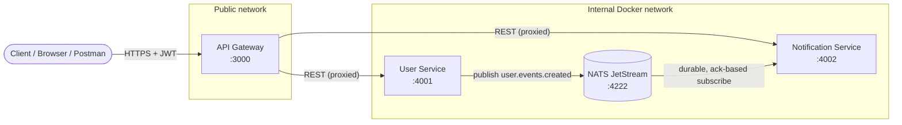
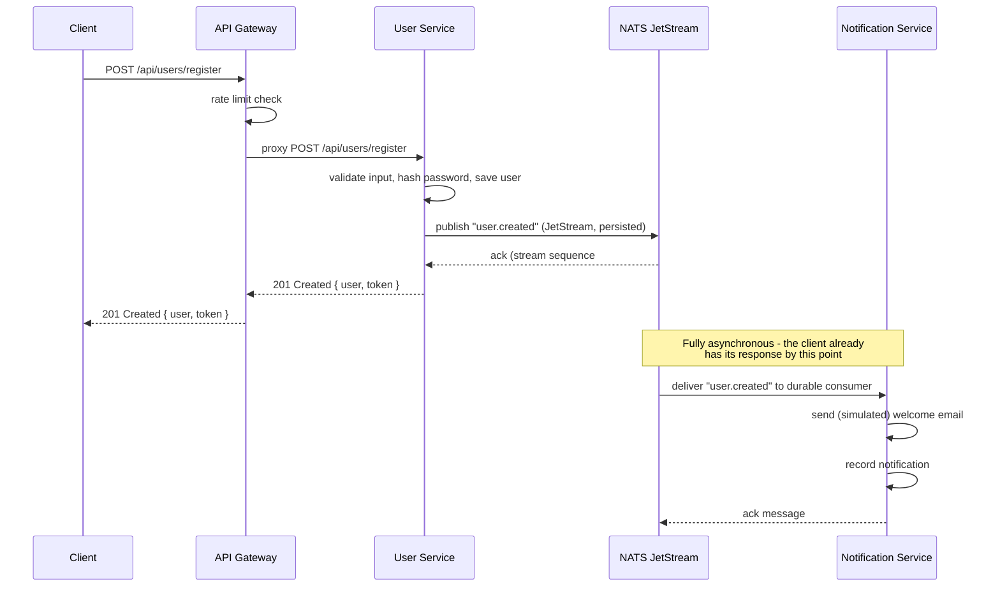

# Architecture

## Overview

The system is composed of three independently deployable services plus a
message broker, all orchestrated with Docker Compose:

| Component             | Responsibility                                              | Port (host) |
|------------------------|--------------------------------------------------------------|-------------|
| API Gateway            | Single public entry point: JWT verification, rate limiting, request routing | 3000 |
| User Service           | Owns user accounts, authentication, publishes `user.created` events | 4001 (internal only) |
| Notification Service   | Subscribes to user events, dispatches welcome notifications, exposes read API | 4002 (internal only) |
| NATS (JetStream)       | Persistent, ack-based message broker for inter-service events | 4222 / 8222 |

Only the API Gateway is exposed to the outside world. `user-service` and
`notification-service` sit on an internal Docker network and are reachable
only from the gateway and the broker.

## Component Diagram

**Key architectural decision:** `User Service` and `Notification Service`
never call each other directly over REST or WebSockets. They communicate
exclusively through asynchronous events on NATS JetStream. This satisfies
the assignment's core constraint and gives the system:

- **Loose coupling** — the User Service does not know or care whether the
  Notification Service is up, slow, or even exists.
- **Independent scaling/deployment** — either service can be scaled,
  redeployed, or temporarily taken down without breaking the other.
- **Extensibility** — a future Analytics Service or Billing Service can
  subscribe to the same `user.created` subject with zero changes to the
  User Service.

## Sequence Diagram — User Registration Flow

## Reliability & Delivery Guarantees

NATS **JetStream** (rather than NATS core pub/sub) is used specifically
because the assignment calls for reliable, production-ready, asynchronous
communication:

- **Persistence** — events are written to disk on the broker (`storage: file`)
  so they survive a broker restart.
- **At-least-once delivery** — the Notification Service uses an explicit
  ack policy (`AckPolicy.Explicit`). A message is only removed from the
  pending set after `msg.ack()` is called following successful processing.
  If the service crashes mid-processing, the message is redelivered.
- **Durable consumer** — the Notification Service's consumer is named
  (`notification-service-durable`) and persists its position between
  restarts, so a redeployed instance resumes exactly where it left off
  instead of skipping or re-reading the entire stream.
- **Bounded retries** — `max_deliver: 5` prevents a permanently-broken
  message from being redelivered forever; after 5 failed attempts it is
  parked for manual inspection (a dead-letter strategy can be layered on
  top by adding a JetStream stream that captures max-deliver exhaustion).
- **Idempotency** — each event carries a unique `eventId`. The publisher
  passes it as the JetStream `msgID` (broker-side de-duplication on
  publish), and the consumer additionally checks it before writing a
  notification, so redelivery never produces duplicate notifications.

## Security

- **Password hashing** — `bcrypt` with a configurable cost factor
  (default 12), never plaintext or reversible encryption.
- **JWT authentication** — the User Service issues short-lived signed
  tokens (`JWT_EXPIRES_IN`, default 1h). The API Gateway verifies the
  token before proxying any protected request; each downstream service
  independently re-verifies it as defense in depth.
- **Secrets via environment variables** — `JWT_SECRET` and all other
  configuration live in `.env` files (gitignored) and are passed to
  containers via `env_file:` in `docker-compose.yml`, never hardcoded.
- **HTTP hardening** — `helmet` sets standard security headers on every
  service; `express-rate-limit` throttles both the gateway (edge) and
  each service (defense in depth), with a stricter limit on `/register`
  and `/login` to slow credential-stuffing attempts.
- **Input validation** — `express-validator` enforces email format,
  minimum password strength, and field-length limits before any
  business logic runs.
- **Network isolation** — only the gateway's port is published to the
  host in `docker-compose.yml`; the backend services and broker are only
  reachable on the internal Docker bridge network.
- **Non-root containers** — each Dockerfile creates and switches to an
  unprivileged `appuser` before running the application.

## Scalability

- Each service is stateless at the process level (all state lives in the
  datastore / broker), so any of them can be horizontally scaled by
  running multiple container replicas behind the gateway / NATS.
- JetStream consumers support **queue groups**, so running multiple
  Notification Service replicas automatically load-balances event
  processing across them without any code change.
- The API Gateway is the only component that needs to be publicly
  reachable, simplifying load balancing and TLS termination at the edge.

## Trade-offs Made for This Assignment

- **Datastore**: `lowdb` (a JSON file) is used instead of PostgreSQL/
  MongoDB so the project runs with `docker compose up` and zero external
  provisioning. The data-access layer (`models/User.js`,
  `store/notificationStore.js`) is isolated behind a small interface so
  swapping in a real database only touches those two files.
- **Email provider**: notification dispatch is simulated (logged to
  stdout) instead of calling a real provider like SendGrid/SES, since
  that would require third-party credentials outside the scope of a
  local assignment. The integration point (`services/emailService.js`)
  is isolated for easy replacement.
